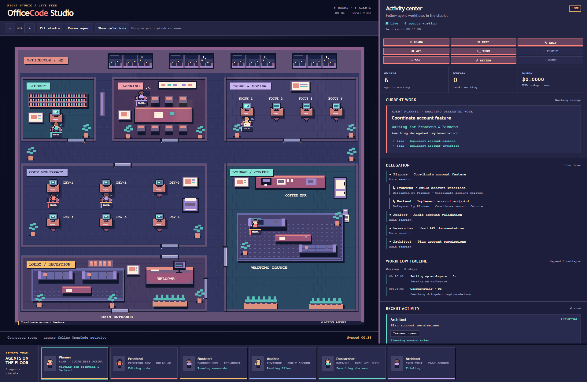

# OfficeCode guide

OfficeCode shows [OpenCode](https://opencode.ai/) session activity as a pixel-art office in your browser. Its global plugin mirrors sessions, tool activity, and permission requests to a local dashboard. **OpenCode still selects and runs every model**; the dashboard does not run models on its own.

## Preview



Six sample sessions show planning, frontend/backend work, auditing, research, and a parent awaiting delegated work. Captured using mirror API sample events in an isolated preview workspace, without model calls.

### Studio atmosphere

The studio follows your browser's local clock automatically. Its windows, floor materials, lighting, and dashboard panels change together:

| Local time | Atmosphere |
|---|---|
| 05:00–10:59 | Morning — mint tiles, warm sunrise, soft daylight |
| 11:00–15:59 | Day — cool blue surfaces, bright sky, subdued lamps |
| 16:00–18:59 | Evening — amber sunlight, rose tones, warm desk lights |
| 19:00–04:59 | Night — the original purple studio palette, moonlight, glowing lamps |

The clock checks every 15 seconds while the page is visible and refreshes when you return to the tab. This runs locally in the browser and makes no model calls. Crowded sessions keep stable seats; the planning table has eight places, and extra workstations appear when the main studio fills up.

## Requirements

- The OpenCode CLI must be installed and the `opencode` command must be available in your terminal. This integration has been tested with OpenCode 1.18.33.
- Node.js 18 or newer and npm. Node.js 22 or newer is recommended.
- Git to clone and update this repository.

The installation steps below have been tested on Windows. The scripts use cross-platform Node.js paths, but macOS and Linux have not been tested directly.

## Install as a global OpenCode plugin

### Install with an OpenCode agent

Start OpenCode in its global configuration folder, then paste the prompt below into the **Build** agent. This gives the agent a clear working directory for installing the plugin and `/dashboard` command. The OfficeCode checkout is a separate, permanent folder that contains the dashboard build.

**Windows PowerShell:**

```powershell
$opencodeConfigDirectory = if ($env:XDG_CONFIG_HOME) {
  Join-Path $env:XDG_CONFIG_HOME "opencode"
} else {
  Join-Path $env:USERPROFILE ".config\opencode"
}
New-Item -ItemType Directory -Path $opencodeConfigDirectory -Force | Out-Null
Set-Location -LiteralPath $opencodeConfigDirectory
opencode
```

**macOS / Linux:**

```bash
opencode_config_dir="${XDG_CONFIG_HOME:-$HOME/.config}/opencode"
mkdir -p "$opencode_config_dir"
cd "$opencode_config_dir"
opencode
```

If OpenCode asks for access to the checkout or configuration folder, grant the directory access needed for this installation. The following prompt authorizes installing OfficeCode globally while preserving your existing OpenCode settings and other plugins.

**Copy and paste this prompt:**

```text
Install https://github.com/ReBioNC/OfficeCode.git as a GLOBAL OpenCode
dashboard plugin so I can use it in any project.

1. Check the operating system and that git, node, npm, and opencode are
   available. Use my existing OpenCode model and provider configuration.

2. Use a permanent OfficeCode checkout at <my home directory>/OfficeCode.
   If it does not exist, clone the repository there. If it already exists,
   check its remote and working tree, then reuse it when it is the correct
   repository. Preserve local changes. If the path belongs to something
   else, ask me for another checkout path. Read the README and inspect
   scripts/install-global.cjs before running the installer.

3. Resolve the GLOBAL OpenCode configuration directory:
   - If XDG_CONFIG_HOME is set: <XDG_CONFIG_HOME>/opencode
   - Otherwise: <my home directory>/.config/opencode, including Windows
   The current directory may already be this configuration directory.

4. From the OfficeCode checkout, run npm ci and npm run install:opencode.
   The installer builds the dashboard and installs exactly these files:
   - <config directory>/plugins/office-dashboard.js
   - <config directory>/plugins/office-dashboard.json
   - <config directory>/commands/dashboard.md
   Preserve existing settings, provider credentials, models, and other
   plugins. Use the installer's backup behavior for existing OfficeCode
   files. Keep the checkout at its permanent path. The JSON file beside
   the plugin must point to that checkout's absolute path.

5. Verify that the installed plugin matches the checkout's source,
   the JSON root points to the checkout, the /dashboard command exists,
   and dist/src/sidecar/index.js plus dashboard/public/app.js were built.
   Report the actual checkout and installed file paths in English.

6. Tell me to close and reopen OpenCode, start it in a project, run
   /dashboard, and open its URL. The dashboard starts when OpenCode loads
   the plugin; /dashboard only shows the URL and status. All models stay
   managed by OpenCode. Do not start npm run dev or set a mock driver as
   part of this global installation.

If a required program is missing or installation fails, report the exact
problem and the next step. Do not claim the installation works until the
file and build checks have passed.
```

Newly installed plugins load after restarting OpenCode. The agent can verify the installation files in the current session; check the running dashboard after reopening OpenCode in your project.

### Install from a terminal

Run these commands in PowerShell or another terminal:

```bash
git clone https://github.com/ReBioNC/OfficeCode.git
cd OfficeCode
npm ci
npm run install:opencode
```

`install:opencode` builds the dashboard and installs the plugin and `/dashboard` command in OpenCode's global configuration directory (`~/.config/opencode/`). If a destination file already exists, the installer saves a `.bak` copy. **Keep the OfficeCode checkout in place after installation**: the global plugin uses build files from that directory.

Close and reopen OpenCode after installing. You do not need to run `npm run dev` or set `OFFICECODE_DRIVER` when using the global plugin.

## Use it in any project

Open a terminal in the project you want to monitor, then start OpenCode:

```bash
cd /path/to/your/project
opencode
```

When OpenCode loads the project, the plugin starts the dashboard server automatically. An OpenCode toast shows its local URL. Run `/dashboard` in OpenCode to see the URL and status again, then open the URL in your browser. The port can differ between projects; use the URL from the toast or `/dashboard` rather than assuming port `8787`.

`/dashboard` only displays information. The global dashboard is a visual view: `POST /api/runs` is disabled in plugin mode, so tasks and models run through OpenCode.

### What the dashboard shows

Dashboard titles, room signs, activity labels, role labels, speech bubbles, accessibility labels, plugin notifications, and `/dashboard` status messages use English. Session titles, prompts, file names, search queries, and custom agent names retain their original text from OpenCode.

Walking uses eight poses in each of four directions and a fixed speed based on elapsed time. The browser redraws moving agents with `requestAnimationFrame`, caches the static office artwork, and lowers the redraw rate while agents are seated. Animation pauses in hidden tabs and stops when no agents remain. Reduced-motion mode shows agents directly at their activity station.

All active OpenCode sessions share one spacious pixel-art office. Six furnished rooms surround wide corridors: a reception lobby, code workspace, planning room, reference library, focus/review room, and lounge with a coffee bar. Window skylines, tiled floors, woven rugs, wall art, bookshelves, plants, mail cubbies, a copier, and kitchen furniture are drawn in code. Local-clock themes still change between morning, day, evening, and night. Sliding doors connect the rooms; agents use straight horizontal/vertical routes around the same walls and furniture that are drawn on screen.

| Room | Actual OpenCode activity |
|---|---|
| **Lobby / reception** | New agents enter here; permission waits use reception. |
| **Code workspace** | Editing, coding, normal terminal commands, and tests. |
| **Planning room** | Thinking and coordinating delegations before a dependency wait is confirmed. |
| **Library** | Reading files, searching the codebase, and web searches. |
| **Focus & review** | QA/auditor work, including reading, editing, and commands; web searches still use the library. |
| **Lounge / coffee** | A pending delegation tool waiting on an active direct child session. |

A dependency wait needs both an active delegation tool and a real parent/subagent relationship from OpenCode. Ordinary Thinking and a session becoming idle are not treated as dependency waits. Concurrent local tools take priority: an agent reading or editing while a delegation runs stays at that activity's station. Permission waits take priority over both. Waiting agents sit on lounge sofas, pause for 3.5 seconds at each stop, and occasionally walk around the coffee area and through the lounge door into the corridor. They retarget their work station when local work resumes or all active child tasks finish. Reduced-motion mode keeps them at their assigned place. Lounge circuits do not run for agents whose overflow seat is outside the lounge.

Agents sit at computers with typing poses and gesture at the planning table. Speech bubbles show the actual tool target or the roles of agents being awaited. The sidebar shows their role, task, current room, and action. Stable seats keep agents distinct as sessions arrive, complete, or change activity. When the main floor is full, a southern team workspace adds real extra desks instead of recycling occupied positions. Use **Focus agent** or zoom to inspect characters in the larger floor. Agents disappear from both the floor and crew deck when their task finishes; history remains inspectable and the next prompt starts a new visible turn.

These states come from OpenCode session, message, tool, and permission events. Explicit roles and custom agent names take priority. A single generic agent is displayed as **Fullstack**. With multiple generic agents, the dashboard may infer a work role from task text (for example Frontend, Backend, Auditor, or QA); the inspector marks these as **inferred role**. The original OpenCode agent name remains in the agent card. These labels describe the visualization and do not assign a new OpenCode agent. The plugin does not make extra model requests for animation or role labels.

### Inspect and navigate

- Click a character, crew card, delegation entry, or **Inspect agent** in Recent activity to select a run. Buttons also support keyboard navigation. Selection remains inspectable after the run completes; completed characters stay off the floor.
- **Current work** shows the selected run's title, role, activity, and tool target. **Active tools** lists concurrent calls. Finishing one call does not return the agent to Thinking while other calls are running. Permission waits stay visible until OpenCode replies.
- **Delegation** groups real parent/subagent relationships from OpenCode. Floor connection lines are hidden by default. Use **Show relations** to display them, or **Hide relations** to return to a clean view. Selecting an agent filters visible lines to its relationships; without a selection, all active relationships are shown. Every page load starts with lines hidden. A parent that is not active on this floor is identified in the list. Relationships are never guessed from task titles.
- **Workflow timeline** shows activity times, elapsed durations, completed/failed tool results, and the final session status. Expand or collapse it as needed. Each run retains its latest 100 steps; the inspector displays the latest 30 and identifies truncated history. This detailed timeline is in memory until the server stops, not a persistent replay or a copy of model reasoning.
- **Fit studio** fits the entire office, including extra desks. **Focus agent** zooms to the selected active character. Use +/−, drag to pan, two-finger pinch to zoom, or Ctrl+wheel on desktop. The view controls never dispatch work.
- Drag the divider beside **Activity center** to give the studio more space or widen the activity details. Focus the divider and use Left/Right arrows (Shift for larger steps), Home for the narrowest panel, or End for the widest. **Hide activity** gives the studio the full width; **Show activity** restores the panel. **Reset layout** or a double-click on the divider restores the default split. Preferences are saved in this browser. On narrow screens the panel stays below the studio and the divider is hidden.
- Twelve avatar models add haircuts, glasses, headsets, beards, and outfit variations across walking, typing, and planning poses. The model, skin, and hair stay consistent per session; shirt color follows the displayed role.
- Connection status distinguishes idle OpenCode, active work, a reconnecting feed, stale data, and an unavailable server. **Last event** reports the latest run update. Quiet idle sessions are valid. Health and snapshots refresh every 10 seconds while visible; animations pause without a connected feed and respect reduced motion.

After updating these features, run `npm run install:opencode` from the checkout, close all OpenCode instances, reopen OpenCode, and hard-refresh the dashboard. New plugin hooks only load after restarting OpenCode.

The dashboard stops when OpenCode closes. If OpenCode exits unexpectedly, its lease expires and the dashboard normally stops about 7–8 seconds after the last heartbeat. If another OpenCode window is still using the same project, the dashboard stays online until the last window closes.

## Local API

The server listens on localhost. Status messages and generated activity details use English.

| Endpoint | Behavior |
|---|---|
| `GET /api/health` | Service identity, workspace, health, `activeLeases`, and `lastEventAt` |
| `GET /api/office` | Office layout, occupants, and mirror mode |
| `GET /api/runs`, `GET /api/runs/:id` | Run details, parent session, concurrent tools, start/finish times, and latest 100 timeline steps |
| `POST /api/runs` | Dispatch a run in development mode; global plugin mode returns `403` with an English message directing users to start tasks in OpenCode |
| `GET /api/queue` | Waiting tasks |
| `GET/PUT /api/models` | Model slots; PUT replaces the whole configuration |
| `GET /api/models/opencode` | Best-effort workspace OpenCode model configuration |
| `GET/PUT /api/budgets` | Budget configuration and estimated spend (`est.`) |
| `POST /api/mirror/session` | Register/update a session; optional `parentSessionId` links real delegations |
| `POST /api/mirror/event` | Mirror activity; optional `activeTools` (up to 64 entries) and `toolResult` (`completed`/`error`, optional `durationMs`) |
| `POST /api/mirror/finish` | Mark a session done/blocked and clear its active tools |
| `GET /api/events` | Server-sent events for dashboard updates |

## File locations

| System | Global plugin and command | Per-project dashboard data |
|---|---|---|
| Windows | `%USERPROFILE%\.config\opencode\plugins\office-dashboard.js` and `commands\dashboard.md` | `%LOCALAPPDATA%\OfficeCode\projects\` |
| macOS / Linux | `~/.config/opencode/plugins/office-dashboard.js` and `commands/dashboard.md` | `~/.local/share/OfficeCode/projects/` |

If `XDG_CONFIG_HOME` is set, the installer uses `$XDG_CONFIG_HOME/opencode/`. Dashboard data may include session titles, tool names, and OpenCode activity history. The server listens only on `127.0.0.1`; the dashboard does not store API keys or contact model providers. See [Privacy](PRIVACY.md) for details.

## Update

### Update with an OpenCode agent

Open OpenCode in its global configuration folder using the [installation instructions](#install-with-an-opencode-agent), select the **Build** agent, and paste the prompt below. It updates the existing OfficeCode checkout and reinstalls the global plugin at the same location.

**Copy and paste this prompt:**

```text
Update my existing GLOBAL OfficeCode plugin from
https://github.com/ReBioNC/OfficeCode.git.

1. Resolve the global OpenCode configuration directory:
   - If XDG_CONFIG_HOME is set: <XDG_CONFIG_HOME>/opencode
   - Otherwise: <my home directory>/.config/opencode, including Windows
   Read plugins/office-dashboard.json to find the installed checkout's
   absolute root. Also check OFFICECODE_ROOT, which takes precedence when
   it points to a valid checkout. Do not assume the checkout is inside
   the OpenCode configuration folder or clone a second copy.
   If the checkout cannot be found, ask me for its location.

2. Check git, node, npm, and opencode are available. Verify that the
   checkout is the OfficeCode repository. Inspect its current branch,
   upstream, remote, and working tree before changing files.
   Preserve local changes. If it has uncommitted changes, no upstream,
   or a diverged branch, explain the issue and ask how I want to proceed.
   Do not reset, discard, stash, or switch branches automatically.

3. From the verified checkout, run git pull --ff-only using the current
   branch's configured upstream. If it fails, stop and report the error.
   Read the updated README and scripts/install-global.cjs, then run
   npm ci and npm run install:opencode. Stop on any failed command.
   This rebuilds the dashboard and reinstalls these global files:
   - <config directory>/plugins/office-dashboard.js
   - <config directory>/plugins/office-dashboard.json
   - <config directory>/commands/dashboard.md
   Use the installer's backup behavior for changed OfficeCode files.

4. Preserve my OpenCode settings, provider credentials, model choices,
   other plugins, and dashboard activity data. Keep the existing checkout
   at its permanent path. Do not update the OpenCode application itself,
   start npm run dev, or set a mock driver for this plugin update.

5. Verify the installed plugin matches the updated checkout's source,
   the JSON root points to its absolute path, the global /dashboard
   command refers to its scripts/dashboard-url.cjs, and
   dist/src/sidecar/index.js plus dashboard/public/app.js exist.
   Report the checkout path, branch, commit before and after the update,
   installed file paths, and verification results in English.
   If there were no new commits, say that it was already up to date.

6. Tell me to close all OpenCode instances after this task finishes,
   reopen OpenCode in a project, run /dashboard, and refresh the browser
   with Ctrl+F5 (or a hard reload) to load the updated dashboard.
   The server starts when the plugin loads; /dashboard is read-only.
   All models remain managed by OpenCode.

Do not claim the update succeeded unless the commands and file checks
passed. Runtime verification happens after restarting OpenCode; clearly
report anything that still needs checking.
```

### Update from a terminal

To get the latest OfficeCode changes and reinstall the global plugin:

```bash
cd /path/to/OfficeCode
git pull --ff-only
npm ci
npm run install:opencode
```

Run these commands from a clean checkout on the branch you want to update. If Git cannot fast-forward, resolve the local changes or branch divergence before continuing. After a successful update, close all OpenCode instances, reopen OpenCode in a project, run `/dashboard`, and hard-refresh the browser to load the new dashboard.

Updating the OpenCode application does not normally require reinstalling OfficeCode. A future OpenCode release may change its plugin API and require an OfficeCode update. After updating OpenCode, reopen it and check `/dashboard`.

## Disable or uninstall

Close OpenCode first. To temporarily disable the global plugin, rename `office-dashboard.js` in the global plugin directory to `office-dashboard.js.disabled`, then reopen OpenCode. To uninstall it completely, remove that plugin file, `office-dashboard.json` in the same directory, and `commands/dashboard.md`. If the installer created `.bak` files from a previous installation, restore them if you still need them.

This repository also contains a project-level plugin at `.opencode/plugins/office-dashboard.js`. When opening the OfficeCode repository itself, disable that file too if you want to use OpenCode without the dashboard.

## Local development

This mode is separate from the global plugin. To run the server manually without calling a model:

```powershell
# Windows PowerShell
$env:OFFICECODE_DRIVER = "mock"
npm run dev
```

```bash
# macOS / Linux
OFFICECODE_DRIVER=mock npm run dev
```

Open `http://127.0.0.1:8787` and press `Ctrl+C` to stop the manual server. A server started with `npm run dev` **does not** follow the OpenCode lifecycle. Run `npm test` to build the project and execute its test suite.

## Troubleshooting

| Symptom | What to do |
|---|---|
| `/dashboard` is not recognized | Run `npm run install:opencode`, then reopen OpenCode. |
| The toast does not show a URL | Check that Node.js is on `PATH`, the OfficeCode checkout has not moved, and `npm run build` succeeds. |
| An old URL no longer opens | Start OpenCode from the same project directory; the dashboard starts when the plugin loads. |
| The port is not `8787` | This is normal. The plugin selects another port when needed; use the URL from the toast or `/dashboard`. |
| The server stays online after OpenCode closes | Check `GET /api/health`. An older sidecar created before lease support (without `leaseManaged`) must be stopped manually once. |

## Project layout

| Directory | Purpose |
|---|---|
| `src/sidecar/` | Local HTTP server, office state, and mirror API |
| `src/dashboard/` | Pixel-art Canvas UI |
| `.opencode/plugins/` | OpenCode plugin source |
| `.opencode/commands/` | Project-level `/dashboard` command |
| `scripts/` | Build scripts, global installer, and URL helper |
| `test/` | Node.js tests |
